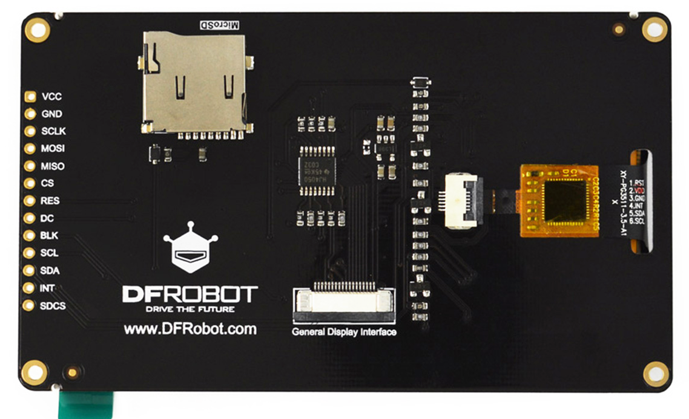

# Raspberry Pi Pico 1 and 2 Capactive Touch Macropads

<p align="left">
 
</p>

The [**Pico 1 RP2040**](https://www.raspberrypi.org/products/raspberry-pi-pico/) and the [**Pico 2 RP2350**](https://www.raspberrypi.com/products/raspberry-pi-pico-2/), are paired with a DFRobot 3.5" capacitive touch LCD - namely the [**DFRobot Fermion Display DFR0669**](https://www.dfrobot.com/product-2107.html). It is a 3.5-inch IPS display with a resolution of 480x320 pixels and supports 5-point capacitive touch using the GT911 touch chip. The module uses the ILI9488 driver chip and communicates via a 4-wire SPI interface. It also features a "General Display Interface" (GDI) for direct connection to compatible controllers. The board includes an onboard MicroSD card slot for storage and operates on a voltage of 3.3V to 5.5V. The Pico 1 handles the shared SDCard and LCD SPI driver well, and allows it to operate at the maximum speed, while the Pico 2 used is the problematic A2 stepping version, and therefore requires the SPI read and write speed to be considerably reduced. The module can also use the [**Sparkfun Qwiic Twist RGB Rotary Encoder**](https://www.sparkfun.com/sparkfun-qwiic-twist-rgb-rotary-encoder-breakout.html) which means there are two i2c devices attached to the Pico 1 or 2 - the GT911 touch controller and the Twist encoder. 

The standard (Bodmer) TFT_eSPI library was used with the addition of a slightly modified [**GT911 library**](https://github.com/tonywestonuk/gt911-arduino).

A 3D-case is provided in two sections - front and back, and prototyping stripboard was used for the construction. The Pico 1 used the same connection pins as the resistive touch Waveshare LCDs originally used for the macropad. The connection details can be found in the (Bodmer) TFT_eSPI configuration files and in the main source code file for each Pico type.  The details are also listed here at the end.

As expected, when compared to the resistive touch macropad, a much lighter touch is required. The key repeat function works well for text macros, but the volume control does not respond well to the Up or Down key being touched without a release. There are two key parameter times that can be changed with \*kr\* and \*ke\*. \*kr\*n with n = duration x 100 before KeyRepeat active in milliseconds. \*kr\*6 will have a wait duration time of 600mS. \*ke\*nn = repeat time after the KeyRepeat is active, in milliseconds. \*ke\*50 will repeat a key held down every 50mS.

The calibration routine is standard with four red circles being displayed at the first run. To use the five small Pad keys on the right-hand side requires tuning the calibration parameters with pixel offsets, but once that is done the five small pads work very well. As the Pad tuning parameters are dependent on whether the LCD is rotated through 180 degrees or not, it is not possible to provide a standard set of tuning parameters. Use the \*ca\*snnsnnsnnsnn (with s = + or - and nn usually about 20 pixels), star control code to provide pixels offsets for the X and Y minimum and maximum values (minXPad maxXPad minYPad maxYPad). Using \*ca\* without any parameters will reset the calibration, and the process will start from the beginning. After the initial 4 corner calibration observe where the five Pads respond to touch - it is usually to the left of the Pad's midpoint as a result of the key position parameters used. Then adjust the calibration using +20 or -20 pixels offsets. For the Pico 2 with a 180 rotation (use \*ro\* to rotate the display 180 degrees and restart), the offsets were maxY + 20  minY - 20  minX - 20  maxX + 20

A PC Windows-based file manipulation and configuration tool for the Pico Touch LCD with auto-app switching based on process name and window title, is included in the folder [**Serial2PicoApp**](https://github.com/TobiasVanDyk/RPi-Pico1-Pico2-Applications/tree/main/TouchMacroPadPico/Serial2PicoApp). Note that after unzipping the app, running the executable the first time will download and install .Net 8 run times. Pressing keys on the PC app can either press the same key on the TouchLCD, which then through USB HID, send the keypress back to the PC, or execute many of the actions directly from the PC App itself. Start the app by selecting the Pico COM port, then press Open port, press ok twice for the json MathSets, open the Config Tab and browse to the location where the apprules.json and Math0 and Math1-9 JSON symbol sets are located, select one of the mathset.json files - make sure the start and end markers are correct for your macropad (to use hex values enter it as 0xhh for example 0x02 and 0x03, and then change) - and then close and reopen the App. Pressing [Open Port] should then load the Pico's current configuration into the app. After this first start it will remember the COM port and Math location used, and it will then automatically load this configuration every time after the Open port button is pressed.


```
Pico 1
#define ILI9488_DRIVER
#define TFT_INVERSION_OFF
#define TFT_BL   13             
#define TFT_BACKLIGHT_ON HIGH  
#define TFT_MISO 12
#define TFT_MOSI 11
#define TFT_SCLK 10
#define TFT_CS   9     
#define TFT_DC   8     
#define TFT_RST  15    
#define SPI_FREQUENCY  20000000
#define SPI_READ_FREQUENCY  8000000

#define TOUCH_SDA 26 
#define TOUCH_SCL 27 
const int pinSdCs = 22;  
const int pinSdClk = 10;
const int pinSdMosi = 11;
const int pinSdMiso = 12; 
pinMode(9, OUTPUT); digitalWrite(9, HIGH);   // TFT CS
pinMode(22, OUTPUT); digitalWrite(22, HIGH); // SD CS
SPI1.setSCK(pinSdClk);
SPI1.setTX(pinSdMosi);
SPI1.setRX(pinSdMiso);
Wire1.setSDA(TOUCH_SDA);       
Wire1.setSCL(TOUCH_SCL);

Pico 2
#define ILI9488_DRIVER 
#define TFT_INVERSION_OFF
#define TFT_BL   13            // LED back-light control pin
#define TFT_BACKLIGHT_ON HIGH  // Level to turn ON back-light (HIGH or LOW)
#define TFT_MISO 16
#define TFT_MOSI 19
#define TFT_SCLK 18
#define TFT_CS   17     // Chip select control pin
#define TFT_DC    20    // Data Command control pin
#define TFT_RST   21   // Reset pin (could connect to RST pin)
#define SPI_FREQUENCY  12000000
#define SPI_READ_FREQUENCY  800000
#define SUPPORT_TRANSACTIONS

const int pinSdCs = 22;  
const int pinSdClk = 18;
const int pinSdMosi = 19;
const int pinSdMiso = 16; // MISO = 8,12 -> SPI1 = 0,4,16 -> SPI0
bool setRX(16); // or setMISO()
bool setCS(17);
bool setSCK(18);
bool setTX(19); // or setMOSI()
SPI.setSCK(18);
SPI.setTX(19);
SPI.setRX(16);
Wire.setSDA(TOUCH_SDA);              
Wire.setSCL(TOUCH_SCL);
Wire1.setSDA(TWIST_SDA);                                 
Wire1.setSCL(TWIST_SCL); 
```

```
Pico 2: used t_x = map(rawY, cal.maxY + 20, cal.minY - 20, 0, 479); t_y = map(rawX, cal.minX - 20, cal.maxX + 20, 0, 319)
struct TouchCal { int minX;  int maxX;  int minY;  int maxY;  int minXPad;  int maxXPad;  int minYPad;  int maxYPad; bool valid; };  // Size 36 bytes 8x4byte signed integers + bool
TouchCal cal = {0, 0, 0, 0, 0, 20, 0, 20, false};   // Pico 2: used t_x = map(rawY, cal.maxY + 20, cal.minY - 20, 0, 479); t_y = map(rawX, cal.minX - 20, cal.maxX + 20, 0, 319)
#define CALIBRATION_FILE "/touch_cal.dat"

case 6: ///////////////////// KeyBrdByte[1]==0x63&&KeyBrdByte[2]==0x61 *ca* = Calibration On *ca*snnsnnsnnsnn X,Y min/max Pad adjust +-0-30 pixels
      { if (knum==4)  { status("Calibrate ON - reboot macropad*"); LittleFS.remove(CALIBRATION_FILE); StarOk = true; break; }
        if (knum==16) { int* padPtrs[] = { &cal.minXPad, &cal.maxXPad, &cal.minYPad, &cal.maxYPad }; int startIdx = 4;
                        for (int j = 0; j < 4; j++) { int sign = (KeyBrdByte[startIdx] == '-') ? -1 : 1;
                                                      int tens = (KeyBrdByte[startIdx + 1] - '0') * 10;
                                                      int ones = (KeyBrdByte[startIdx + 2] - '0');      
                                                      *padPtrs[j] = sign * (tens + ones); startIdx += 3; }
                        status("Calibrate Pad adjustments done - reboot macropad"); saveCalibration(); StarOk = true; break; }
        break; }

case 38: ////////////////////// KeyBrdByte[1]==0x6b&&KeyBrdByte[2]==0x72 *kr* Duration/100 before KeyRepeat active in milliseconds
       { //               01234567890123456789012345678
         char KRVal[] = {"Key Repeat x00 msec"} ;
         if (b<2) { status("Add number 2-9"); break; }           // Use the [ADD]ed number to assign 2-9
         RepTimePeriod = b*100; KeyRepeat = b; KRVal[11] = k4;   // Value 2-9 => 200-900 milliseconds 
         Config1[36] = KeyRepeat; WriteConfig1Change = true;  status((char *)KRVal); StarOk = true; break; }  

case 39: ////////////////////// KeyBrdByte[1]==0x6b&&KeyBrdByte[2]==0x65 *ke* Duration after KeyRepeat active in milliseconds
       { //                01234567890123456789012345678
         char KRVal2[] = {"Key Repeat   msec"} ;
         if (c99<10) { status("Add number 10-99"); break; }            // Use the [ADD]ed number to assign 10-99 mS
         KeyRepeat2 = c99; KRVal2[11] = k4; KRVal2[12] = k5;  

```


