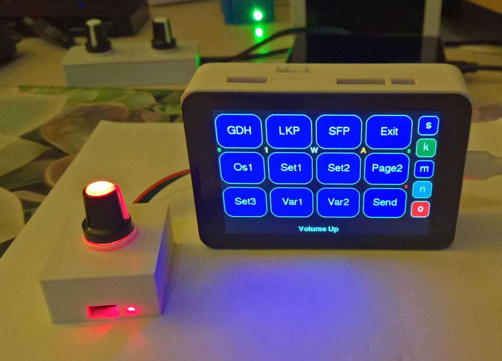
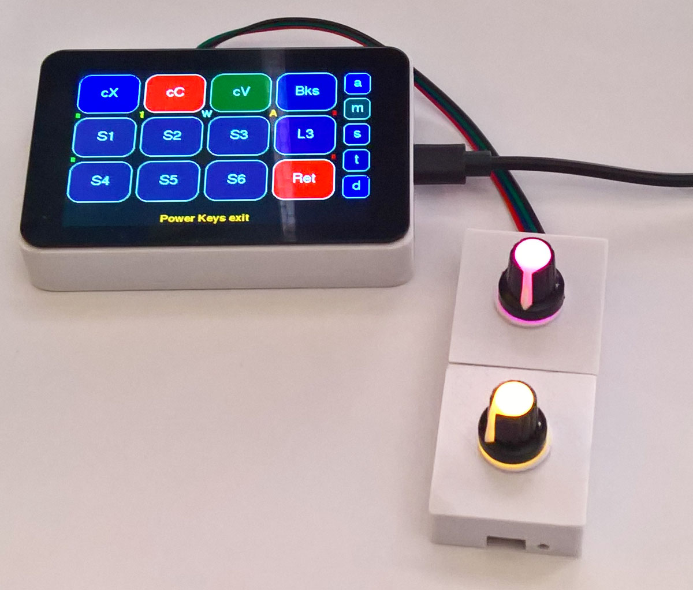
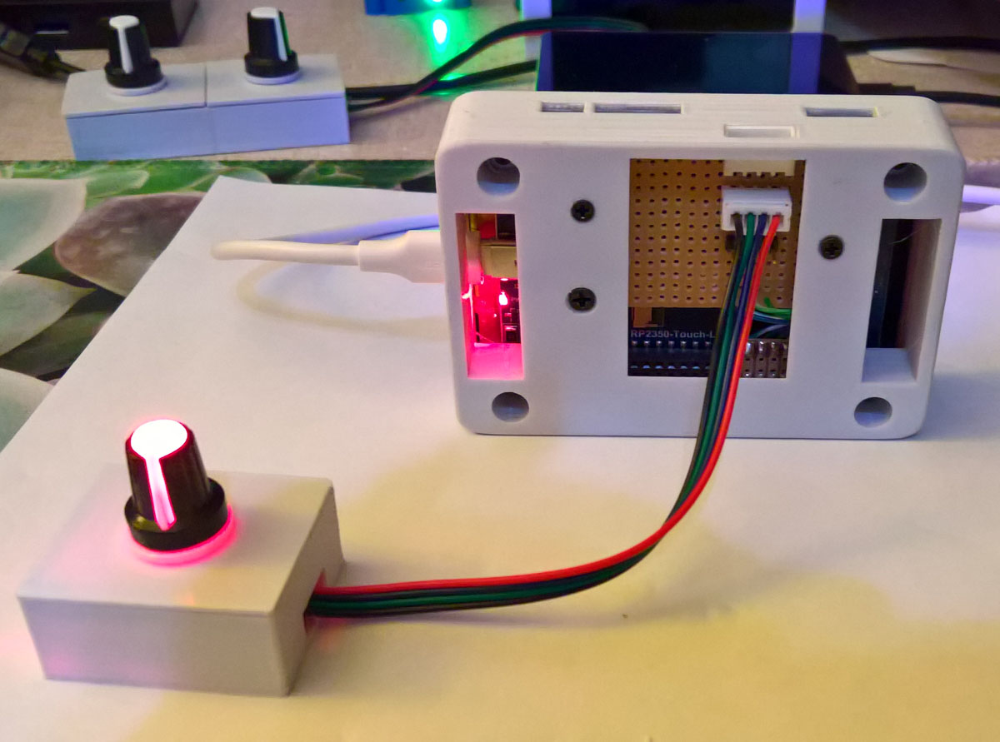
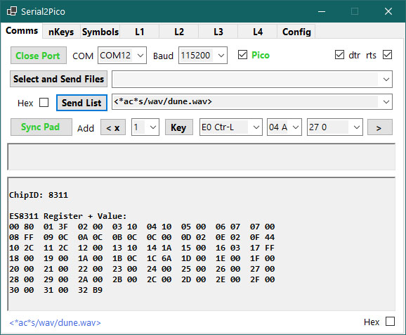
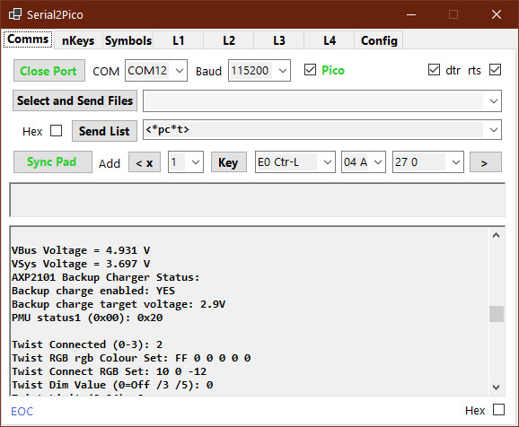

# Raspberry Pi RP2350B Capacitive Touch Macropad

          
         
    
 

     The [**Waveshare RP2350B-A4 FT6336 Capacitive Touch ST7796 LCD 3.5 480x320 with RTC and SDCard module**](https://www.waveshare.com/RP2350-Touch-LCD-3.5.htm) is the device of choice for the Touch Macropad as it costs little more than the similar sized resistive touch version. It requires only a few external libraries and no calibration before use, and is also an IPS panel with good visibilty when used lying flat. It has an advanced function power switch for the LCD and expansion socket 3v3 power, and audio and sensor modules. 

The LCD's ES8311 audio codec can play wav files stored on the SDCard - this is managed as a starcode \*ac\* function and uses the Arduino-Pico i2s libraries, but it does not require any external ES8311 libraries. A collection of suitable 24kHz 16bit mono PCM files are included here: Wav24kHz16bitMono.zip. It handles the *key-held-then-key-repeat function* well which is important when using the two volume keys and also when quickly scrolling through all the starcodes options with the \[*Cm\] key. There is [**more information here**](https://docs.waveshare.com/RP2350-Touch-LCD-3.5?variant=RP2350-Touch-LCD-3.5). The build and source files are in the Pico2A4LCD folder, and the 3DCase files in the 3D-Case folder.  The LCD's integrated **PCF85063A RTC** can use the standard rechargeable Raspberry Pi 5 RTC Panasonic ML-2020 Lithium Manganese Dioxide Battery and the time sync is automatic via the PC App. The **APX2101 PMIC** charges the RTC battery and provides VBus and VSys values with \*ic\*6 and \*ic\*7.

The touchpad can also use the [**Sparkfun Qwiic Twist RGB Rotary Encoder**](https://www.sparkfun.com/sparkfun-qwiic-twist-rgb-rotary-encoder-breakout.html) which means there are two groups of i2c devices attached to the RP2350B - the internal group on the i2c1 bus includes the FT6336 touch cocntroller, the ES8331 audio codec, the RTC chip, the PMIC, and the external devices on the i2c0 bus such as the Twist encoder and the GPIO expanders. 

A PC Windows-based file manipulation and configuration tool for the Pico Touch LCD with auto-app switching based on process name and window title, is included in the folder [**Serial2PicoApp**](https://github.com/TobiasVanDyk/RPi-Pico1-Pico2-Applications/tree/main/TouchMacroPadPico/Serial2PicoApp). Note that after unzipping the app, running the executable the first time will download and install .Net 8 run times. Pressing keys on the PC app can either press the same key on the TouchLCD, which then through USB HID, send the keypress back to the PC, or execute many of the actions directly from the PC App itself. Start the app by selecting the Pico COM port, then press Open port, press ok twice for the json MathSets, open the Config Tab and browse to the location where the apprules.json and Math0 and Math1-9 JSON symbol sets are located, select one of the mathset.json files - make sure the start and end markers are correct for your macropad (to use hex values enter it as 0xhh for example 0x02 and 0x03, and then change) - and then close and reopen the App. Pressing [Open Port] should then load the Pico's current configuration into the app. After this first start it will remember the COM port and Math location used, and it will then automatically load this configuration every time after the Open port button is pressed. Make sure the Macropad's serial comms is enabled else enable with *se* before connecting to the PC App.

