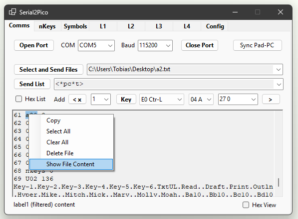
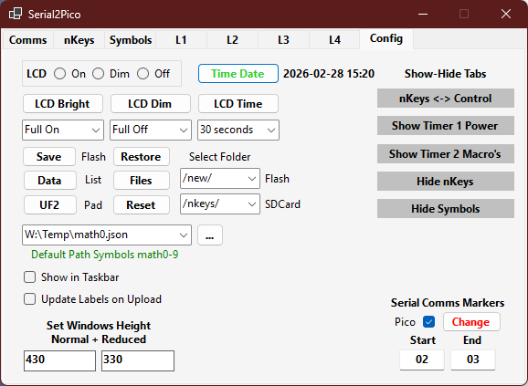
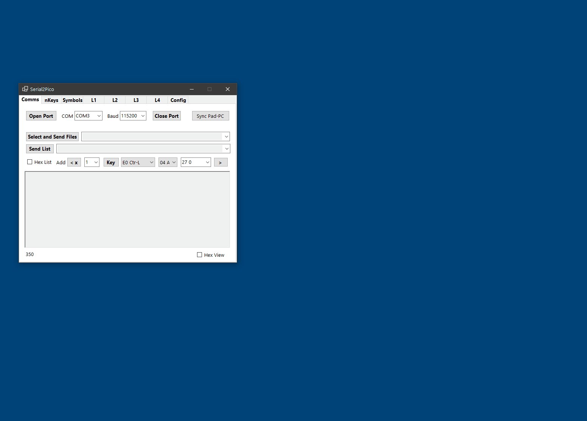

# Serial2Pico is a configuration and control app for the PicoTouchLCD developed in Visual Studio 2022 C# .NET8

 
 
  
 

Can list files in folders with \*lf\*sdcardfolder or \*lf\*sdcardfolder+flashfolder. From the PC App use the two comboboxes in the Config tab to enter the folders or use / for the
root. Can select the listed /folder/filename and Delete or View content from the Comms tab. Use for example from the PC App Send List: 
<\*lf\*> lists all flash files and all sdcard files 
<\*lf\*/store/> lists all flash files and the sdcard files in folder /store.
<\*lf\*/store/+/new/> lists all flash files in the folder /new and the sdcard files in folder /store.
<\*lf\*/+/new/> lists all flash files in the folder /new and all the sdcard files (the folder is now root /).
<\*lf\*/+/> lists all flash files and all the sdcard files (the folder for both is now root /).

Refer to [**Win11-99**](https://github.com/TobiasVanDyk/RPi-Pico1-Pico2-Applications/blob/main/TouchMacroPadPico/Serial2PicoApp/Win11-55.png) for a layout of the Config tab.

A option to change the Start and End markers from the current < and > have been completed as described below. Suitable candidates are the 0x02/0x03 start/stop transmission pair or a seldom used character such as the back-tick \`. When using the PC App with a changed set of markers, keep on using the < > as framing characters in all typed send-lists in the PC App as a function replaced the C# serialport.Write which translates < > to the new set of markers. Using a paired set of < > brackets are also visually easier to recognise as bookends than for example a 0x02/0x03 or \` ~ or a # @ pair. 

To change the serial start/stop markers to 02hex/03hex type 0x02 and 0x03 into the Comms Tab of the PC App and tick the checkbox named Pico if the changes should be sent to the Pico as well - with the checkbox marked the PC App had been tested with the 0x3C/0x3E pair and the 0x02/0x03 pair - enter the values in hex as 0x01-0x7E if the box is ticked. If the changes are made separately, press [Change] and then close the app, reopen it and check if the values shown are 02 and 03. Then only change it on the Pico macropad using the macroEditor - enter \*2s\*0203 [EXE], exit the Editor and press [Cfg]->[Sav>]. Note that Start/Stop pairs > 0x1E are not working currently, although pair values > 0x1F can be entered using for example \*2s\*D0D1 or as \*2s\*208209.

As noted the Serial Comms Start and End Markers can now be changed to a different ASCII character or to any value 1-255 on the Pico and also to any hex value between 0x01 and 0xFF inthe PC App, such as using 0x02 and 0x03 as hex numbers, or enter < or > as text, in the textboxes in the Change Start and End Marker section on the Config Tab. For manual changes, use \*1s\*char for the Start marker and \*1e\*char for the End marker, or use \*2s\*charchar or \*2e\*charchar to change both start and end characters, or use \*1s* or \*1e* to reset both to the < > pair. When it is changed on the Pico change it on the PC App before syncing, and remember to keep on typing < data > in the PC App, as the translation to any different start and stop pair is done automatically. Because the Pico Start and End marker settings are saved in the Config1 file, their values will be 0 after loading the new firmware - this condition where both are 0x00 are handled by resetting them to the default < and >. Otherwise use the Macro editor on the Pico and enter \*1s\* and save with the [Cfg]->[Sav] config button, before opening the PC App, or enter as \*1s\*< and \*1e\*> and save. 

Added Layout 1, 3, and 4 (M, S, T keys), [Select and Send Files] multi-file select buttons - this saves as <1 File content > to <6 Filecontent > for each of the 4 Skeys layers A-D, i.e. one or more, and up to 24 files can be sent at once. Each file will be assigned to M, S, T key 1 to 24. If for Layout 3 the current Layer is for example B and six files are uploaded then S keys S7 to S12 will be assigned to the new files named S7 to S12, irrespective of their original names when selected on the PC. The files can be macros or text files in any combination, but in both cases must be terminated with a Null (0x00) character. 

Added <f filecontent > to <F filecontent > when using the [Select and Send Files] multi-file select button on the nKeys tab with nKeys checked - this then saves as nChar+0+1-9 if<10 or nChar+10-999. 

One or many files can be copied from the PC App to the Pico Macropad using the [Select and Send Files] button on the Comms tab. This button has a dual-function: After an intial selection of one or more files, the combobox next to the button is filled with the list of files sent. If one of these are selected, or a new file and its path typed into the combobox, the button when pressed will not first open a dialog box to select files but will send the single file selected immediately to the MacroPad.  The Pico macropad will name these files numerically as file1 to file 9999. A filename sync will be implemented later, for the time being use <\*rn\*file1=a01> for example, or use the [Ren] function in the Pico Editor itself to rename the new files. Note that the SDCard must be the destination i.e. A-D must be brown, these files should not be saved to Flash directly as they can be large. Use \*sx\* to reset the number count to 1. Use \*sx\*flename or \*sx\*/foldername/ to change the name used or path where files are saved -but these setting are not saved. The Pico is not a PC so when dragging more than ten or twenty files they should be small, or for larger files (maximum size is 6144 bytes), copy less than five at a time. This functionality is ideal for uploading a set of nKeys - for example first upload a set of 9 keys where you used <\*sx*\n0> to set the base filename, then upload the rest (up to about 980 more), with a base filename <\*sx\*n>. The filecount will not reset between uploads unless you use <\*sx\*>. To reset filename to null use \*sx\*\*\* and use \*sx\*// to set foldername to null. In summary: \*sx\*name where name = filename or /foldername/ or // folder = "" or ** filename = "" or if no name reset filenumber to 1.

There is a screen video which illustrates this new function - [**SelectandSendFiles**](https://github.com/TobiasVanDyk/RPi-Pico1-Pico2-Applications/blob/main/TouchMacroPadPico/Serial2PicoApp/SelectandSendFiles.gif)

HeaderToText tool converts the various stringt24.h and strings24.h into 24 files. Drag and drop the header file into the form.

Arduino Label Tools converts label.json files to Pico macropad label1,2,3 type Arduino files. See the example label001.json for the JSON format. Drag and drop the json label file into the form, then rename to LabelM,S,T and copy to SDCard. Can send Label.json files to macropad via PC App. Use the checkbox in config tab if LabelM,S,T file must be automatically updated when new labelfiles are uploaded. labelfiles are saved as label1,2,3 depending if L1,l2,L3 upload used.

After generating a list files on the SDCard and Flash memory with the File List option from the Config Tab, a right-click on the selected filename gives the option to delete or view the file (in a readable format). If the file is in the SDCard list make sure the A-D indicator is brown, and similarly white A-D if in the Flash listing, before clicking on one of the two options. The other three options  (Clear, Copy, and  Select all), are text and not file operation options. NB: When selecting the file by double-clicking the name - that adds a space at the filename end - there is a trim-end that should remove the extra spaces in the filename - otherwise carefully select just the filename itself then right-click on it and choose Delete or View Content.

**Instructions for Serial2Pico with json Symbols Bank loader:**
1. Put your json math0.json to math9.json files in a folder such as C:\Temp, or any other folder.
2. Open Serial2Pico - you may get two messages that the math bank file cannot be found - click OK on each message.
3. Open the Config tab and press on the [...] button to select your default symbols bank file.
4. The location will be saved in C:\Users\User\AppData\Local\Serial2Pico\xyz\user.config

To send a symbols bank to the LCD touchpad select a file with the [...] button in the Symbols tab, enter a number 0 to 9 in the combo-box just below the box where the selected filename is, and the press [Send File]. The LCD should confirm it with the name of the symbols bank such as Math4. You then must load the bank in the LCD using the Load key. Note that if you had chosen a file named math3.json and entered 6 in the box below the filename the LCD will save the file as Math6.

The combo-box at the bottom loads symbol banks 0-9 from the default location into the PC App. After selecting a bank press Page1-4 once to see the new bank.

An example how to use the Send List in the Comms Tab to copy files: Copy file LabelT from SDCard to Flash - On the macropad press Pad [k] then press Pad [o] until the source on the left is brown and the destination on the right is white. On the PC App enter the string <\*cf\*LabelT=LabelT> in the textbox to the left of the button [Send List], and then press [Send List] to copy the file. As an alternative to using the macropad send <\*ae\*2> to change the Source=SDCard and Destination=Flash before sending the copy command. Note that <\*ae\*1> would copy from Flash to SDCard (because 1 = 01 and 2 = 10).

Refer to [**Win11-77**](https://github.com/TobiasVanDyk/RPi-Pico1-Pico2-Applications/blob/main/TouchMacroPadPico/Serial2PicoApp/win11-88.png) for a layout of the Symbols tab.

A PC Windows-based configuration tool for the Pico Touch LCD in its early development stages is included in the folder Serial2PicoApp - it will be developed over the next few months if not years. Additional tabs that must still be completed include configurations tabs for the Power and Macro Timer-Clocks, a tab for associating PC apps with macros, and a general configuration tab for various parameters such as LCD timeouts etc. Note that after unzipping the app, running the executable the first time will download and install .Net 8 run times. Pressing keys on the PC app can press the same key on the TouchLCD, which then through USB HID, send the keypress back to the PC. Start the app by selecting the Pico COM port, then press Open port, and then press Get Config to load the Pico's current configuration into the app. After the first start it should remember the COM port used and it will then automatically load the configuration after the Open port is pressed.

When the app is minimzed it will move to the system tray - click on the icon there to open it again. The app can be switched to three sizes (Tab row + Keypad + Config panel or by removing the Tab row and/or Config panel), using the green and blue up and down arrows in the lowest part of the keypad. The sizes can be changed by entering it in the Config tab - it will save the new sizes automatically. A useful direct key control has been added - switch the nKeys via the Config tab to Control - all 17 keys on any page of the LCD can then be pressed from the PC. To use the nKey or M,S,T bank of keys select from the 2 boxes "Press MST Keys with Delay" and/or "Send nKeys with Delay" (select a delay from the combobox next to Delay). To use the 8 other keys i.e. Cut, Copy, Paste, Delete, and Return (or the keys that replaced them), select the box "Press other Keys with Delay" (select a delay from the combobox close to the label). If the TouchlCD is in the dimmed state te first keypress will be ignored and is only used to wake the Macropad. When using the nKeys remember to switch the middle pad to E=Execute and not S=Show, and check that the SDCard or Flash selected is the medium that has the nKeys files. Note that there is also an automatic focus shift to the next opened app on the desktop: Use the delay=\* or the Alt+Esc option instead of a manual focus change for PC App using "\*" for delay value after key pressed on PC app. For example <k103\*> is sent from the PC App (also possible to do by using the Comms tab and the Send list button), or when key [S1] is pressed with checkbox selected with Delay = \*. This will then send (in my case) a textstring to the next visible app which is notepad using Alt+Esc to move the focus to notepad and then print the textstring.

The Glyph section can send glyphs banks and symbols as json files either directly from the App, or via the LCD keypress send, or from being stored them in the Windows clipboard, for use in MSWord or Libre Office. If \* is chosen for the Delay (default), then the focus will automatically change to the next open program such as Word by using Alt+Esc before the glyph is sent. Other ways include changing focus from the PC app to Word manually, i.e. send the glyph with a selected delay of about 1/2 to 2 seconds, or choose the option to trigger it from the macropad send key. Instructions for selecting the default Symbol Bank folder are as described above. Test the Glyphs function directly by using the Comms tab and the Send list button, and then sending <g2211\*1> with Word open - the Sum glyphs should be written in Word after the focus has changed automatically from the PC App to Word.

To use Timer 1 (Power and Restart) in synchronous mode with the MacroPad i.e. the Pad screen will mimic that of the PC App, select in L2 either of the two checkboxes to Press Keys, then click [Cfg], then [ROf], then click one of the Timers. Make sure the LCD screen shows the same as the PC App - note that when the LCD is dimmed the first keypress will be ignored and used to wake the LCD. When you are in the mode where the [Cfg] button is [Sav] and you do not want to save the current configuration click [L2]. All 12 keys in Layout 2 is now functional but in the next layer when [Cfg] is pressed [mCT], [Opt], and [Key] must still be configured. The three media keys [Med], [Vm], [Vol] in this section are working in configuration mode - i.e. after changes press the "Change key", and also in mimic mode if the "Press other keys" is on.

Note that the standard manner in which applications such as on-screen-keyboards work around the focus problem is to override two classes that ensures that the on-screen keyboard application doesn't gain the focus as a result of mouse clicks, and also prevents the form from coming to the foreground upon loading, are not suitable for this specific program, as it needs to be able to also function as a normal keep-focus form and form decorations, such as buttons.

Much of the C# code (but not the tab layout design), has been with the help of Google (Gemini), and various Copilot incantations such as the GitHub, Windows 11, and Visual Studio ones, whilst ChatGPT solved many of the trickier problems. *A "standalone" PC clone of the TouchLCD is also planned for the far future - the TouchLCD will be replaced by a Pico 1/2 with and SDCard, which will function as as an HID USB dongle.*

Serial2Pico loads the current button definitions, labels, Layouts and Layers configuration from the TouchLCD as either raw data or text data, when the Get Config button on the Main tab of Serial2Pico is pressed. This needs a new version of the TouchLCD firmware, but can be used with the older firmware but then with less functions. 
