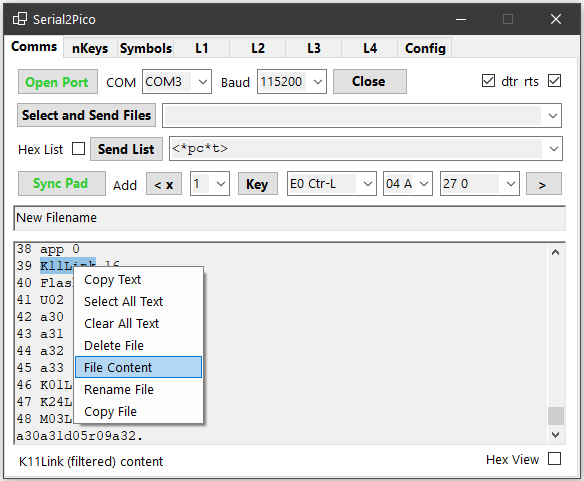
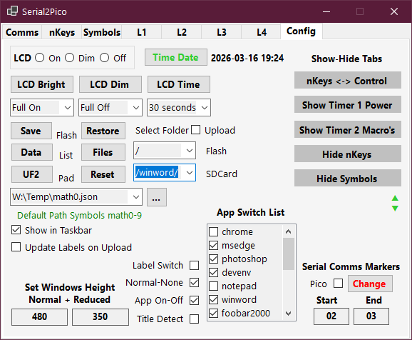
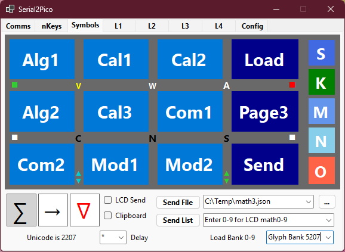
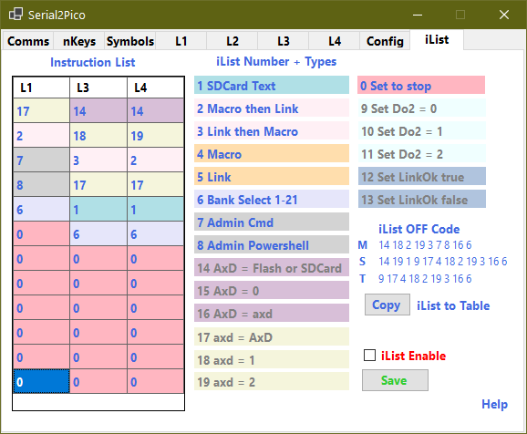
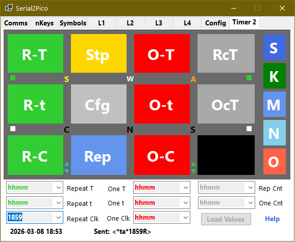
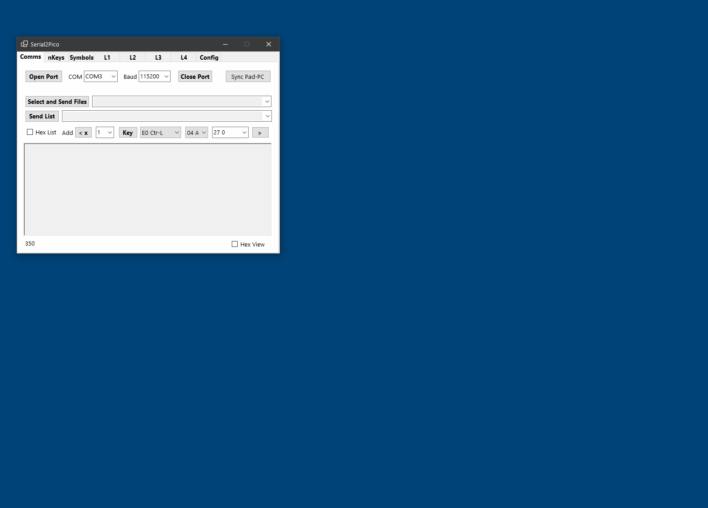
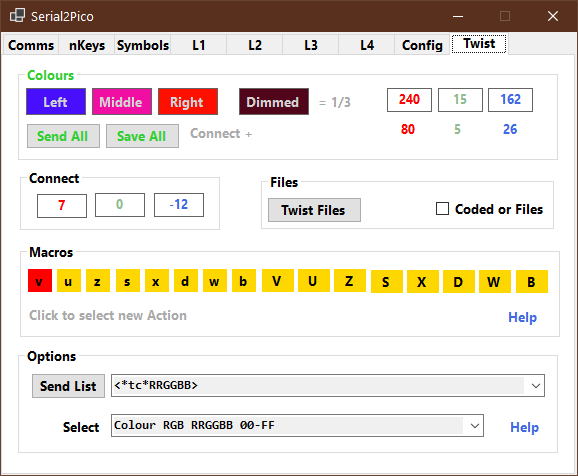
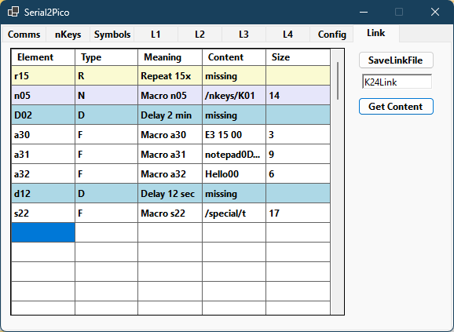
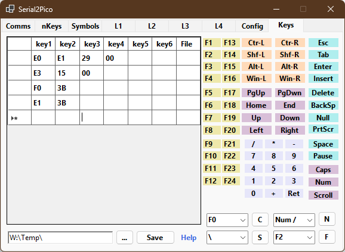
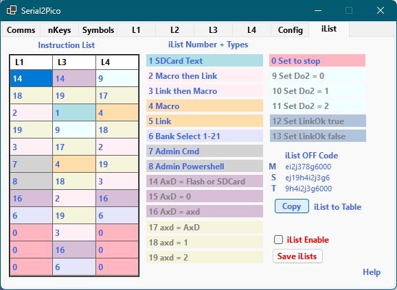

# Serial2Pico is a configuration and control app for the PicoTouchLCD

 
 
  
   
    
 

Serial2Pico is a configuration and control app for the Pico Touch LCD developed in Visual Studio 2022 C# .NET8, which is a mimic of the Pico macropad, with additional controls below the mimic, and navigation tabs above it.

There is now an exercise that demonstrates [**how to use the Keys and Links tabs in the PC App**](https://github.com/TobiasVanDyk/RPi-Pico1-Pico2-Applications/blob/main/TouchMacroPadPico/Serial2PicoApp/Exercise1.pdf) and the files are uploaded here as Exercise1-files.zip.

 **Twist Rotary Encoder tab** Link added to PC App - enable the tab by clicking on its label **Twist** in the Config tab. Start the configuration by choosing a colour for the middle pad first - then upload with "Send all". Even strange values yields unexpected results - try RGB 255 128 64 in the top right boxes and then -10 9 8 in the left connect boxes, click Send All, then on the Pico save it by [Cfg][Sav] test.

 **Macro Link List tab** Link added to PC App - enable the tab by clicking on its label **Link** in the Config tab. This is a plaintext list of files to be executed in sequence with additional commands such as delay and repeat. Refer to manual.h for more info. Start by placing your macro files in the same location as the symbols json files or enter a new location in the path box in the Keys tab. Press enter after the filename has been typed and then try entering other commands such as DD1 or r23 and press enter. After the list has been completed press the button [Get Content] and the first 10 bytes of the files listed and their sizes will be shown if the files are in the location mentioned before. Save by entering a Filename in the textbox and press save.

 **Keys construction tab** added to PC App - enable the tab by clicking on its label **Keys** in the Config tab. Its use should be clear - click on cell then label or click on cell then choose from combobox and press key next to it. Use the keyboard for the normal keys 0-9 and A-Z to type directly in the cell. Type in a filename to save and press [Save]. The picture shows the three ways in which the Pico can send simultaneous HID keypresses - two using the modifier byte and one without the byte. The FE option in the Pico firmware is currently being tested.

 **Macro Instruction List tab** iList added to PC App - enable the tab by clicking on its label **iList** in the Config tab. See manual.h for a description in section (z). The Pico code have not been tested extensively. Although instruction lists are designed mainly for sets of macro-keys or macro-layouts, and linked lists for individual macro-keys, there are many similarities and also many differences in their potential use. Many new types of instruction sequences that can be built using these i-lists - some are similar and some are difficult with the macro linked lists XxxLink. For example a long coded section can be added for one key in one Layout - see the two examples for admin powershell and admin command shells. Another example is that a JSON module that reads json scripts can be added to the iList options.

The DataGridView + dataset approach used for the instruction lists will also be applied next in the construction of linked lists where pre-configured macro-files and actions, are added to the column to construct the list.

**Testing:** Layouts 1, 3, and 4 (keys M S T) are available for custom labels and app-switching - currently only one active layout at a time - but every active layout can have many active apps. If more than one layout with App->Checked then it will use L4 before L3 before L1. Use with custom labels enabled, which can be switched on/off from the L1 L3 L4 tab of each layout. Added nKeys switching and open and close commands when an app is opened or closed. The new apprules.json has six additional editable fields for these. For example when MSWord is opened the nKeys will change to nKeys set w01 to w996, and a star \<\*xy\*z\> or \<x \> command can be sent when it opens and when it closes. This means another five keys can be customized per app, by using a command such as \<\*xn\*list\> to set the keys [Cut], [Copy], [Paste], [Delete], and [Return], to other functions. If a list of commands needs to be executed at application startup use the \<n nPage nKey \> as the start command. The original nKeys set is restored after the last app closes. Remember to put macro files inside the /app/ folder that matches the layout i.e. use T01 but not S01 or M01 when L4 is active. *Note that the nKeys commands that runs when the app opens can be changed to any of the other macropad control commands - i.e. three different commands can run when the app opens, and one when it closes.*

**Explanation:** Difference in file name pointer behaviour between link-files (filenames such as K01Link, M24Link etc.) and nkeys (filename such as n01, H976, y003, 556 etc), when application switching is active: The nKeys path is only used to find the nKey file itself, and the path-name and file-name inside the nKey file, is independent of that path. Link files use the same path to find the link-file as the list of filename(s) (without paths), in its content. [**More info**](images/explain1.png)

[**Read this**](https://github.com/TobiasVanDyk/RPi-Pico1-Pico2-Applications/blob/main/TouchMacroPadPico/Serial2PicoApp/Five-Macro-Types-with-Label-Changes.pdf) for an an example of how to use five types of macros with the App Switching function. 

**Installion and first use:** Note that after unzipping the app, running the executable the first time will download and install .Net 8 run times. Start the app by selecting the Pico COM port, then press Open port, press ok twice for the json MathSets, open the Config Tab and browse to the location where the apprules.json and Math0 and Math1-9 JSON symbol sets are located, select one of the mathset.json files - make sure the start and end markers are correct for your macropad (to use hex values enter it as 0xhh for example 0x02 and 0x03, and then change) - and then close and reopen the App. Pressing [Open Port] should then load the Pico's current configuration into the app. After this first start it will remember the COM port and Math location used, and it will then automatically load this configuration every time after the Open port button is pressed. Pressing keys on the PC app can either press the same key on the TouchLCD, which then through USB HID, send the keypress back to the PC, or execute many of the actions directly from the PC App itself - to switch focus from the app to the PC application when pressing keys, select the two options in Layout L2 and make sure star \* is shown in the delay box - for media controls such as volume use a zero instead of the  star. 

The [auto-app-switch function is completed](../Readme.md#combine-app-switch-approaches) and it includes auto-label switching - use the new apprules.json and edit the fields except the windows app name - for example  "App":"chrome", "Arg":"", "Layout":"4", "Enabled":true, "AppLabel":false, - set the AppLabel to true and put the name of the labelfile that is inside the folder chrome on the SDCard in the last field else the default for Layout T will be used which is label3. You also need the 24 macro actions as files t01-t24 (if the T keys are used), inside the folder chrome that will be used when Chrome is open. Refer to the file TkeysWord.zip which has the 24 macro files for MS Word (winword folder). Each of the three Layouts M, S, T have an auto-app-switch enable/disable and the PC App has a list of these apps which can be enabled/disabled. When enabled a Layout and its 4 layers, will switch all of its macros to the app-specific macros, and change its labels to app-specific labels. It will be 24 keys per app at first but can easily be doubled to 48 keys per app (SDCard + Flash = 24 + 24 keys). If required the nKeys can be adapted to be app-aware as well which will yield 996 labels and macros per app for 72 different apps. To change the Apps list displayed and from which apps can be selected, edit the apprules.json file which should be placed in the same folder as the symbols json file, and the file location entered in the Config tab.

*The usability of the App Switch feature is inversely related to its complexity. For best results, include only those applications that benefit most from customized macros, and then only enable two or three at the same time. Use the Application list in the Config tab to enable or disable apps, then save your changes. Alternatively, you can edit the apprules.json file directly.. Also remember that the application folder can also contain macrofiles, nKeys which are pointers to any file elsewhere in the system, and also macrolinks - a list of macros and instructions to be executed when pressing a macro key.* 

App Switch function - the PC App sends the name of the opened program that has focus and is on the PC App internal list (such as firefox, visual studio, edge, chrome, word, notepad etc):
  \*ap\*appname=1,3,4 creates a folder /appname/ if it does not exist on the SDCard and assigns appname to the keys in Layout 1,3,4. Pressing the keys M1-M24 or S1-S24 or T1-T24 will then execute macros files such as t01 to t24 inside the SDCard folder /appname/. 
  \*ap\*appname=0 switches appname app switch off. 
  \*ap\*1,3,4 assigns app switch to Layouts 1, 3, or 4 = M S T keys. 
  \*ap\* disables App Switch function
  NB: Each Layout tab 1, 3, 4 has a checkbox App that must be checked to enable app switching for that tab. The Comms tab will show the app switching commands being sent. The PC App already has provisioned App page title switching as well, but this has not fully tested as yet - enable it with the checkbox in the Config tab and add the window title names to the apprules.json file.

*When using the PC App the < > bracket set and the \*Commands are added automatically after Enter is pressed, by the Macrotimer and Powertimer pages - this will require the [Load values 3x] key to be pressed two or three times to complete a setup.* The set of Macro Timers have been mostly completed. What is left is to assign a function to the [Rep]eat key, decide on how to handle repeating-clock timers (i.e. should they ignore the date and only use the time etc), and to decide how to differentiate meaningfully between the [RcT], [R-C], [OcT], and [O-C] timers. (Note that the Time and Clock handlers for Pico 1 is using its HW RTC where Sunday = 0, and the Pico 2 is using TimeLib.h where Sunday = 1.) Use < t\*mnnn> or < t\*mnnn> to program the timer-macro link where t = timer 1-8 and m = 0 - 5 i.e. 012345 = mstakn, For example m = macro M1-M24, same for s and t, a = macrofiles a01-a99, k = Linkfiles Knnlink, n = nKeys 001-999 or 01-99 - when executing the timer will use the current nChar = a-zA-Z-0-9 if a the star after the timer number is a space, and if it is an alphanumeric that will be used as the nKeys character. The 3rd \* is for a Link file, replace it with a space if a Link file is not used, or a different nChar. The Macrotimer runs files not macro keys i.e. to run macro S01 there must be a file s01 either on the SDCard or Flash. After sending t\*values press [Cfg]->[mCT] and then press the timer button that corresponds to the number t = 1-8. Because the same code is used in the macro-editor enter nn or nnn as one less than the macro key value i.e. enter nn-00 for key M01. To run one-shot timer [O-t] with K11Link which is on the SD Card and all the files linked in K11Link are also on the SDCard, send 4\*410 and then press [O-t]. Sending 2 100 will run the repeat timer 2 [R-t] on macro S01. 2 000 will run the one-shot timer 2 [O-t] on macro M01 provided there is a file named m01 on the SD Card or Flash. 2 100 will do the same with macro file s01. To set the macro Clock time timers three steps are needed: (1) First link a macro with the one or more of the clock timers 5 - 8. For example 5 100 will link macro file S01 to Timer 5 [R-C]. (2) Then send 26030771410 which will set alarm timers 5 and 6 = [R-C] and [O-C] to 14h10 and (3) press [R-C] on the LCD (or app if the "use other keys" had been selected). At 14h10 macro file S01 will trigger once only, because the full date will never again occur. For a 24 hour cycle repeat use the short form hhmm instead of the full date 7 March 2026: Press [Looad values 3x] until hhmm show, replace it with the trigger hours and minutes hhmm such as 1410, press enter, and finally press the correspomding timer key on the Macrotimer page. Remember the < > and also the *Commands are are not required, they are added automatically. 

Use 8 100 then 26030771435 and press [OcT] then at 14h35 S01 will trigger a oneshot macro S01. Using the button [Data] in the Config tab of the PC App will show the state of the 8 timers. When using the shorter format hours + minutes time setting, first send 5 100 as before to link S01 with Timer 5 [R-C], then send 0854 - you only enter the hhmm = 0854 the app adds the <\*ta\* R> - and then press key [R-C], to trigger S01 at 08h54 in repeat mode. The Pico 1's RTC HW only allows for setting one alarm callback at a time. 

Changed Time and Clock handlers for Pico 1 (using its RTC where Sunday=0), and Pico 2 (using TimeLib.h where Sunday=1). Power Timers Clock-Restart and Clock-PowerOff functional with a choice of using shorter time-set options hours and minutes as hhmm (i.e. 24 hours max time-span) by using *ct*hhmmR,O, or using a full date + time < Pyymmddwhhmm >. To test set time using PC App then [Cfg]->[ROf] type in top grey box below [R-C] and [O-C] buttons current time + 3 minutes for example 1630 if time is 16h27. and press enter. Then if both MST and Other Keys are checked and Delay = 0 in Layout L2, press [R-C] key either in the PC App or on the TouchLCD. After the first enter the LCD will display "Restart Clock ON" and after [R-C] pressed it will display "Restart on Clock" - leave the LCD on and after 3 minutes it will open the run box and type the reboot command.

It can also list, copy, delete, rename, and view, files and folders in the SDCard and Flash memory folders using \*lf\*sdcardfolder or \*lf\*sdcardfolder+flashfolder. From the PC App use the two comboboxes in the Config tab to enter the folders or use / for the root. It can select the listed /folder/filename and delete or view the file content from the Comms tab. 
 Use for example from the PC App Send List: 
 <\*lf\*> lists all flash files and all sdcard files 
 <\*lf\*/store/> lists all flash files and the sdcard files in folder /store.
 <\*lf\*/store/+/new/> lists all flash files in the folder /new and the sdcard files in folder /store.
 <\*lf\*/+/new/> lists all flash files in the folder /new and all the sdcard files (the folder is now root /).
 <\*lf\*/+/> lists all flash files and all the sdcard files (the folder for both is now root /).

Note that all commercial and open-source macropads that I have searched for, and examined, use a configuration file (or files), to store macros and or chained macros, compiled or in plain text, definitions and scripts. This macropad uses individual macro files and more importantly symbolic link files, which offers most customisation options common to all file systems, such as arranging files in folders, and then renaming those folders, that other macropads cannot easily duplicate with any giant or tiny, sophisticated or simple, JSON or XML files. In addition it offers direct access to and from, other file systems, here such as those on a Windows PC.

Refer to [**Win10-87**](https://github.com/TobiasVanDyk/RPi-Pico1-Pico2-Applications/blob/main/TouchMacroPadPico/Serial2PicoApp/images/Win10-87.png) for a layout of the Config tab. The Upload checkbox is used by the Select and Send button on the Comms tab to copy one or more files to either the root folder of the SDCard or Flash, or to the folder typed in the two comboboxes in the Config tab. The rename files textbox, used for both the Copy File and Rename File functions, is at the top of the fiielist box - to rename a file from the filelist generate a filelist from the List Files button in the Config tab, open the Comms tab, type in the new name in the text box that has "New Filename" in it, right-click on the file in the filelist that is to be renamed and select click Rename File. To copy a file the options are (1) copy using the same filename between SDCard and Flash, or (2) copy on the same medium using a new filename. For the latter enter a new filename in the textbox before selecting the file to be copied. Note that the maximum filesize for these copy operations is 250 bytes - for larger files use the [Select and Send Files] button, or for megabyte-sized files copy directly to the mounted SDCard from a PC. Also note that when copying from SDCard to Flash you must select the file from the SDCard list and vice versa.

A option to change the Start and End markers from the current < and > have been completed as described below. Suitable candidates are the 0x02/0x03 start/stop transmission pair or a seldom used character such as the back-tick \`. When using the PC App with a changed set of markers, keep on using the < > as framing characters in all typed send-lists in the PC App as a function replaced the C# serialport.Write which translates < > to the new set of markers. Using a paired set of < > brackets are also visually easier to recognise as bookends than for example a 0x02/0x03 or \` ~ or a # @ pair. 

To change the serial start/stop markers to 02hex/03hex type 0x02 and 0x03 into the Comms Tab of the PC App and tick the checkbox named Pico if the changes should be sent to the Pico as well - with the checkbox marked the PC App had been tested with the 0x3C/0x3E pair and the 0x02/0x03 pair - enter the values in hex as 0x01-0x7E if the box is ticked. If the changes are made separately, press [Change] and then close the app, reopen it and check if the values shown are 02 and 03. Then only change it on the Pico macropad using the macroEditor - enter \*2s\*0203 [EXE], exit the Editor and press [Cfg]->[Sav>]. Note that Start/Stop pairs > 0x1E are not working currently, although pair values > 0x1F can be entered using for example \*2s\*D0D1 or as \*2s\*208209.

As noted the Serial Comms Start and End Markers can now be changed to a different ASCII character or to any value 1-255 on the Pico and also to any hex value between 0x01 and 0xFF inthe PC App, such as using 0x02 and 0x03 as hex numbers, or enter < or > as text, in the textboxes in the Change Start and End Marker section on the Config Tab. For manual changes, use \*1s\*char for the Start marker and \*1e\*char for the End marker, or use \*2s\*charchar or \*2e\*charchar to change both start and end characters, or use \*1s* or \*1e* to reset both to the < > pair. When it is changed on the Pico change it on the PC App before syncing, and remember to keep on typing < data > in the PC App, as the translation to any different start and stop pair is done automatically. Because the Pico Start and End marker settings are saved in the Config1 file, their values will be 0 after loading the new firmware - this condition where both are 0x00 are handled by resetting them to the default < and >. Otherwise use the Macro editor on the Pico and enter \*1s\* and save with the [Cfg]->[Sav] config button, before opening the PC App, or enter as \*1s\*< and \*1e\*> and save. 

Added Layout 1, 3, and 4 (M, S, T keys), [Select and Send Files] multi-file select buttons - this saves as <1 File content > to <6 Filecontent > for each of the 4 Skeys layers A-D, i.e. one or more, and up to 24 files can be sent at once. Each file will be assigned to M, S, T key 1 to 24. If for Layout 3 the current Layer is for example B and six files are uploaded then S keys S7 to S12 will be assigned to the new files named S7 to S12, irrespective of their original names when selected on the PC. The files can be macros or text files in any combination, but in both cases must be terminated with a Null (0x00) character. 

Added <f filecontent > to <F filecontent > when using the [Select and Send Files] multi-file select button on the nKeys tab with nKeys checked - this then saves as nChar+0+1-9 if<10 or nChar+10-999. 

One or many files can be copied from the PC App to the Pico Macropad using the [Select and Send Files] button on the Comms tab. This button has a dual-function: After an intial selection of one or more files, the combobox next to the button is filled with the list of files sent. If one of these are selected, or a new file and its path typed into the combobox, the button when pressed will not first open a dialog box to select files but will send the single file selected immediately to the MacroPad.  The Pico macropad will name these files numerically as file1 to file 9999. A filename sync will be implemented later, for the time being use <\*rn\*file1=a01> for example, or use the [Ren] function in the Pico Editor itself to rename the new files. Note that the SDCard must be the destination i.e. A-D must be brown, these files should not be saved to Flash directly as they can be large. Use \*sx\* to reset the number count to 1. Use \*sx\*flename or \*sx\*/foldername/ to change the name used or path where files are saved -but these setting are not saved. The Pico is not a PC so when dragging more than ten or twenty files they should be small, or for larger files (maximum size is 6144 bytes), copy less than five at a time. This functionality is ideal for uploading a set of nKeys - for example first upload a set of 9 keys where you used <\*sx*\n0> to set the base filename, then upload the rest (up to about 980 more), with a base filename <\*sx\*n>. The filecount will not reset between uploads unless you use <\*sx\*>. To reset filename to null use \*sx\*\*\* and use \*sx\*// to set foldername to null. In summary: \*sx\*name where name = filename or /foldername/ or // folder = "" or ** filename = "" or if no name reset filenumber to 1.

There is a screen video which illustrates this new function - [**SelectandSendFiles**](https://github.com/TobiasVanDyk/RPi-Pico1-Pico2-Applications/blob/main/TouchMacroPadPico/Serial2PicoApp/SelectandSendFiles.gif)

HeaderToText tool converts the various stringt24.h and strings24.h into 24 files. Drag and drop the header file into the form.

Arduino Label Tools converts label.json files to Pico macropad label1,2,3 type Arduino files. See the example label001.json for the JSON format. Drag and drop the json label file into the form, then rename to LabelM,S,T and copy to SDCard. Can send Label.json files to macropad via PC App. Use the checkbox in config tab if LabelM,S,T file must be automatically updated when new labelfiles are uploaded. labelfiles are saved as label1,2,3 depending if L1,l2,L3 upload used.

After generating a list files on the SDCard and Flash memory with the File List option from the Config Tab, a right-click on the selected filename gives the option to delete or view the file (in a readable format). If the file is in the SDCard list make sure the A-D indicator is brown, and similarly white A-D if in the Flash listing, before clicking on one of the two options. The other three options  (Clear, Copy, and  Select all), are text and not file operation options. NB: When selecting the file by double-clicking the name - that adds a space at the filename end - there is a trim-end that should remove the extra spaces in the filename - otherwise carefully select just the filename itself then right-click on it and choose Delete or View Content.

**Instructions for Serial2Pico with json Symbols Bank loader:**
1. Put your json math0.json to math9.json files in a folder such as C:\Temp, or any other folder.
2. Open Serial2Pico - you may get two messages that the math bank file cannot be found - click OK on each message.
3. Open the Config tab and press on the [...] button to select your default symbols bank file.
4. The location will be saved in C:\Users\User\AppData\Local\Serial2Pico\xyz\user.config

To send a symbols bank to the LCD touchpad select a file with the [...] button in the Symbols tab, enter a number 0 to 9 in the combo-box just below the box where the selected filename is, and the press [Send File]. The LCD should confirm it with the name of the symbols bank such as Math4. You then must load the bank in the LCD using the Load key. Note that if you had chosen a file named math3.json and entered 6 in the box below the filename the LCD will save the file as Math6.

The combo-box at the bottom loads symbol banks 0-9 from the default location into the PC App. After selecting a bank press Page1-4 once to see the new bank.

An example how to use the Send List in the Comms Tab to copy files: Copy file LabelT from SDCard to Flash - On the macropad press Pad [k] then press Pad [o] until the source on the left is brown and the destination on the right is white. On the PC App enter the string <\*cf\*LabelT=LabelT> in the textbox to the left of the button [Send List], and then press [Send List] to copy the file. As an alternative to using the macropad send <\*ae\*2> to change the Source=SDCard and Destination=Flash before sending the copy command. Note that <\*ae\*1> would copy from Flash to SDCard (because 1 = 01 and 2 = 10).

Refer to [**Win11-77**](https://github.com/TobiasVanDyk/RPi-Pico1-Pico2-Applications/blob/main/TouchMacroPadPico/Serial2PicoApp/win11-88.png) for a layout of the Symbols tab.

When the app is minimzed it will move to the system tray - click on the icon there to open it again. The app can be switched to three sizes (Tab row + Keypad + Config panel or by removing the Tab row and/or Config panel), using the green and blue up and down arrows in the lowest part of the keypad. The sizes can be changed by entering it in the Config tab - it will save the new sizes automatically. A useful direct key control has been added - switch the nKeys via the Config tab to Control - all 17 keys on any page of the LCD can then be pressed from the PC. To use the nKey or M,S,T bank of keys select from the 2 boxes "Press MST Keys with Delay" and/or "Send nKeys with Delay" (select a delay from the combobox next to Delay). To use the 8 other keys i.e. Cut, Copy, Paste, Delete, and Return (or the keys that replaced them), select the box "Press other Keys with Delay" (select a delay from the combobox close to the label). If the TouchlCD is in the dimmed state te first keypress will be ignored and is only used to wake the Macropad. When using the nKeys remember to switch the middle pad to E=Execute and not S=Show, and check that the SDCard or Flash selected is the medium that has the nKeys files. Note that there is also an automatic focus shift to the next opened app on the desktop: Use the delay=\* or the Alt+Esc option instead of a manual focus change for PC App using "\*" for delay value after key pressed on PC app. For example <k103\*> is sent from the PC App (also possible to do by using the Comms tab and the Send list button), or when key [S1] is pressed with checkbox selected with Delay = \*. This will then send (in my case) a textstring to the next visible app which is notepad using Alt+Esc to move the focus to notepad and then print the textstring.

The Glyph section can send glyphs banks and symbols as json files either directly from the App, or via the LCD keypress send, or from being stored them in the Windows clipboard, for use in MSWord or Libre Office. If \* is chosen for the Delay (default), then the focus will automatically change to the next open program such as Word by using Alt+Esc before the glyph is sent. Other ways include changing focus from the PC app to Word manually, i.e. send the glyph with a selected delay of about 1/2 to 2 seconds, or choose the option to trigger it from the macropad send key. Instructions for selecting the default Symbol Bank folder are as described above. Test the Glyphs function directly by using the Comms tab and the Send list button, and then sending < g2211\*1 > with Word open - the Sum glyphs should be written in Word after the focus has changed automatically from the PC App to Word.

To use Timer 1 (Power and Restart) in synchronous mode with the MacroPad i.e. the Pad screen will mimic that of the PC App, select in L2 either of the two checkboxes to Press Keys, then click [Cfg], then [ROf], then click one of the Timers. Make sure the LCD screen shows the same as the PC App - note that when the LCD is dimmed the first keypress will be ignored and used to wake the LCD. When you are in the mode where the [Cfg] button is [Sav] and you do not want to save the current configuration click [L2]. All 12 keys in Layout 2 is now functional but in the next layer when [Cfg] is pressed [mCT], [Opt], and [Key] must still be configured. The three media keys [Med], [Vm], [Vol] in this section are working in configuration mode - i.e. after changes press the "Change key", and also in mimic mode if the "Press other keys" is on.

Note that the standard manner in which applications such as on-screen-keyboards work around the focus problem is to override two classes that ensures that the on-screen keyboard application doesn't gain the focus as a result of mouse clicks, and also prevents the form from coming to the foreground upon loading, are not suitable for this specific program, as it needs to be able to also function as a normal keep-focus form and form decorations, such as buttons.

Much of the C# code (but not the tab layout design), has been with the help of Google (Gemini), and various Copilot incantations such as the GitHub, Windows 11, and Visual Studio ones, whilst ChatGPT solved many of the trickier problems. [**It is therefore correct to describe it as both an agentic (and agenetic), and human-derived, product.**](https://github.com/TobiasVanDyk/RPi-Pico1-Pico2-Applications/blob/main/TouchMacroPadPico/Serial2PicoApp/images/agentic-agenetic.png) *A "standalone" PC clone of the TouchLCD is also planned for the far future - the TouchLCD will be replaced by a Pico 1/2 with and SDCard, which will function as as an HID USB dongle.*

Serial2Pico loads the current button definitions, labels, Layouts and Layers configuration from the TouchLCD as either raw data or text data, when the Get Config button on the Main tab of Serial2Pico is pressed. This needs a new version of the TouchLCD firmware, but can be used with the older firmware but then with less functions. 
